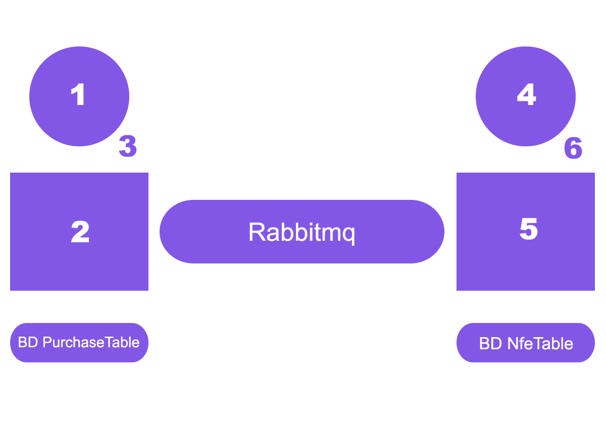
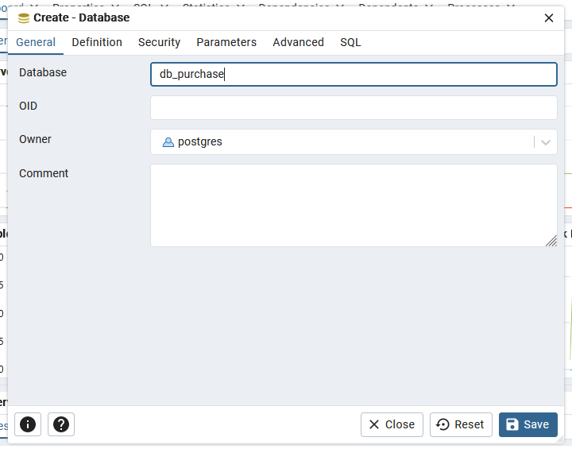
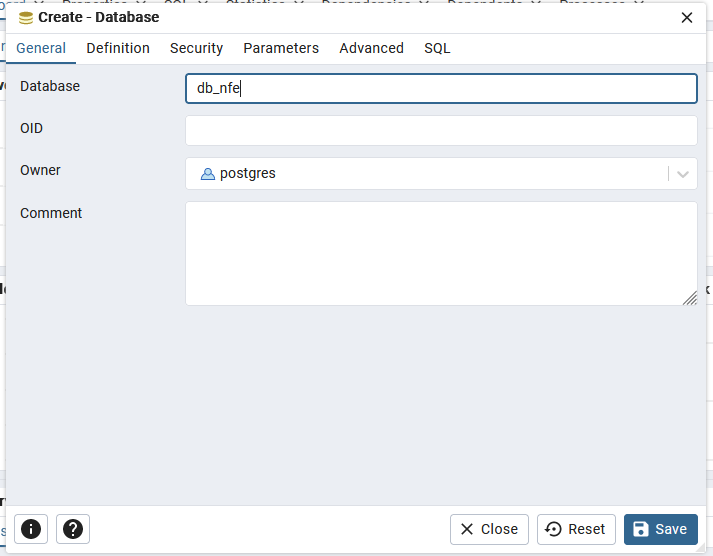
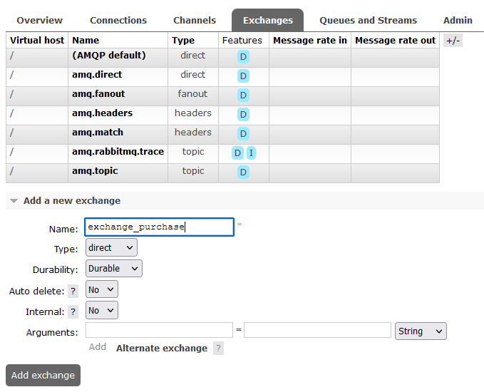
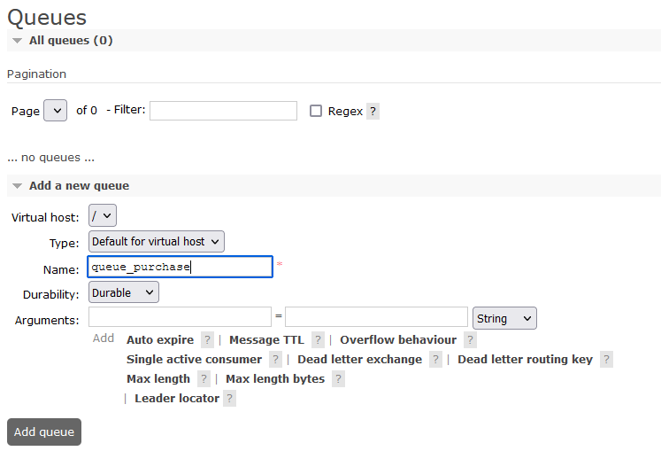
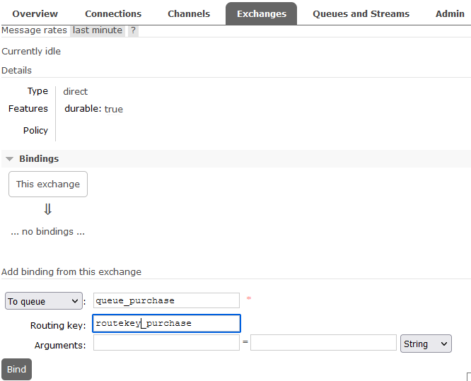
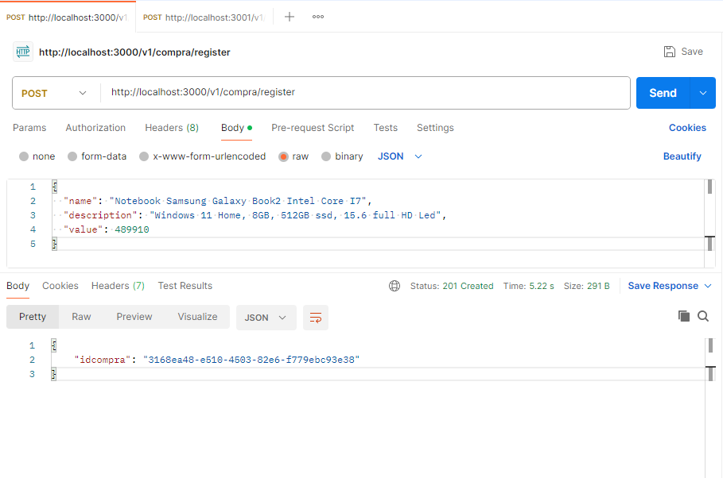
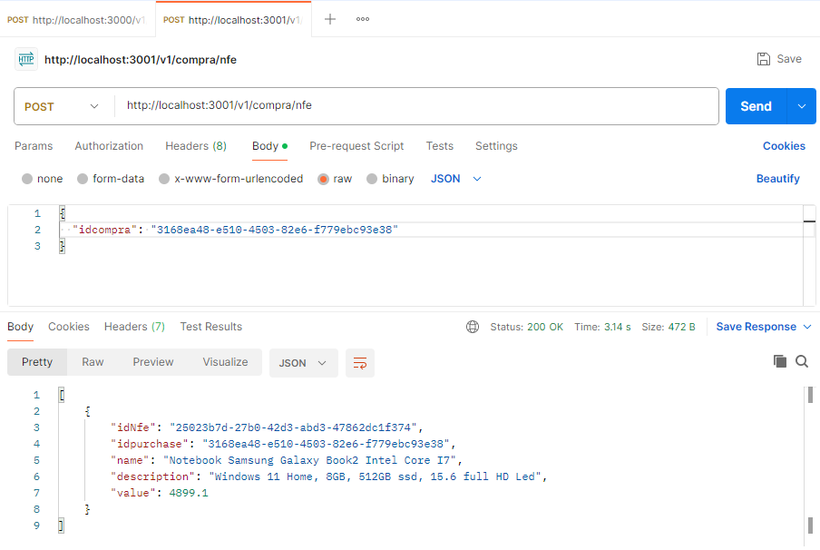

## O que são microsserviços?
A arquitetura de microsserviços (geralmente chamada de microsserviços) refere-se a um estilo de arquitetura para o desenvolvimento de aplicativos. Os microsserviços permitem que um aplicativo grande seja separado em partes independentes menores, com cada parte tendo sua própria responsabilidade.
Fonte: cloud.google.com

Com o intuito de oferecer uma melhor manutenibilidade e desacomplamento, assim como foi explicado acima, a minha ideia(😛) foi aplicar a arquitetura de microsserviços a uma aplicação de compras da seguinte forma: Um microsserviço para guarda os dados da compra e outro para guarda os dados da nota fiscal eletrônica de cada compra. 
Segue abaixo o fluxograma do projeto.

## 📋 Fluxograma da Aplicação



- [1] Usuário faz uma compra.
- [2] Sistema recebe os dados da compra e envia para o rabbitmq e para o banco de dados "db_purchase".
- [3] Sistema disponibiliza o id da compra para o usuário. 
- [-] Rabbitmq recebe os dados da compra e salva para ser consumido por outro sistema.
- [-] Banco de dados "db_purchase" salva os dados do produto e o id da compra.
- [4] Usuário envia o id da compra para o sistema.
- [5] Sistema recebe o id da compra enviado pelo usuário, captura os dados do rabbitmq, salva os dados no banco "db_nfe" e faz uma busca pelos dados da nota fiscal do produto tendo como referencia o id da compra enviado pelo usuário.
- [6] Sistema disponibiliza os dados da nota fiscal eletrônica para o usuário.
- [-] Rabbitmq disponibiliza os dados da compra enviado pelo sistema do passo 2 para o sistema do passo 6 consumir.
- [-] Banco de dados "db_nfe" salva os dados do produto o id da compra e o número da nota fiscal eletrônica.


## 🔨 Tecnologias Utilizadas

 1. NodeJs
 2. Express
 3. Prisma
 4. Postgresql
 6. Docker
 7. Rabbitmq
 8. Clean Architecture

## 👨‍💻 Como executar o projeto com Docker.

### Passo a passo
✅✅ Clone Repositório
```sh
git clone git@github.com:FelipeDevFull/microservice.git
```
Acesse o Diretório Principal
```sh
cd microservice
```
Suba os containers (postgresql, pgadmin e rabbitmq) do projeto
```sh
docker compose up -d
```
Crie os banco de dados "db_purchase" e "db_nfe".



Configure o rabbitmq
1. Crie o exchange.

2. Crie a queue.

3. Conecte a exchange com a queue.


✅✅ Acesse o Diretório Consumer
```sh
cd microservice/consumer
```
Crie o Arquivo .env e atualize as variáveis de ambiente postgresql e rabbitmq.
```sh
cd .env.example .env
```
```sh
DATABASE_URL=""
RABBITMQ_URL=""
```
Suba o container Consumer
```sh
docker compose up -d
```


✅✅ Acesse o Diretório Producer
```sh
cd microservice/producer
```
Crie o Arquivo .env e atualize as variáveis de ambiente postgresql e rabbitmq.
```sh
cd .env.example .env
```
```sh
DATABASE_URL=""
RABBITMQ_URL=""
```
Suba o container Producer
```sh
docker compose up -d
```
## 📋 POSTMAN

### Dados da Compra
[http://localhost:3000/v1/compra/register](http://localhost:3000/v1/compra/register)


### Dados da Nota Fiscal Eletrônica
[http://localhost:3001/v1/compra/nfe](http://localhost:3001/v1/compra/nfe)
